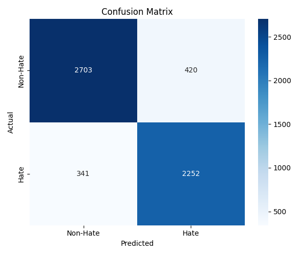
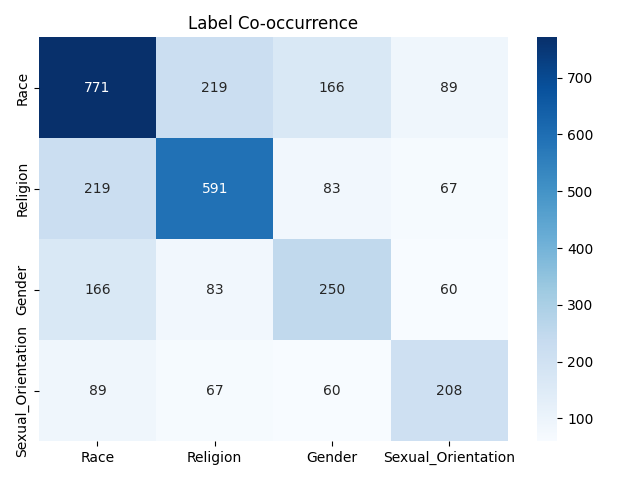

# MyHateDetect – Multilingual Hate Speech Detection System

MyHateDetect is a dual-stage classification platform for detecting and categorising **hate speech** in English and Malay texts. Built with a focus on code-switched social media texts (tweets), the system uses multilingual BERT (mBERT) to ensure high accuracy across diverse linguistic contexts.

## System Architecture

**Stage 1: binary classification (hate vs non-hate):** to determine if a tweet contains hate speech. 

**Stage 2: multilabel hate type classification:** to identify the specific nature of the hate speech (Race, Religion, Gender, Sexual Orientation).

## Research & Performance

The system is fine-tuned over 10,000 bilingual tweets. mBERT is selected  for deployment due to its performances in both stages.

**Stage 1**
The confusion matrix below shows the model's ability with high True Positive count.



**Stage 2**
The Label Co-occurrence Heatmap illustrates the intersectional nature of hate speech.It reveals how different categories, such as Race and Religion, often overlap in toxic discourse.


## Features

* **Dual-Stage Pipeline:** Optimised detection architecture. Stage 1 acts as a filter (Hate vs. Non-Hate), while Stage 2 performs deep-dive categorisation.
* **Multilingual BERT (mBERT) Integration:** Specifically fine-tuned for high accuracy in both English and Malay, outperforming standard monolingual models.
* **Advanced Multi-Label Categorisation:** Identifies multiple hate speech types (Race, Religion, Gender, Sexual Orientation) simultaneously in a single tweet.
* **Role-Based Access Control (RBAC):** Secure access for **Admins** (system management and CSV uploads) and **Policymakers** (read-only visualisation and trend analysis).

## Folder Structure

```
MyHateDetect/
├── app/
│   ├── templates/            # HTML for dashboard, visualisation, auth
│   ├── routes/               # Flask Blueprints
│   ├── static/               # Logo used in UI
│   ├── stage_predict.py      # Final prediction script (stage 1 + 2)
│   ├── text_utils.py         # Preprocessing & Auto-NLTK setup
│   └── utils.py              # Progress bar, database functions
├── sql query/
│   └── myhatedetect.sql      # MySQL database dump
├── experiment/
│   ├── stage1/               # Binary classification: Training notebooks, model weights & performance visuals
│   ├── stage2/               # Multi-label classification: Training notebooks, model weights & visuals
├── sample_uploads   # Sample dataset files for tweets upload and user registration use
├── requirements.txt          # Clean list of dependencies for website
├── run.py                    # Entry point for Flask app
└── README.md                 # Project documentation and setup guide
```

## Demo Credentials

| Role        | Email                   | Password    |
|-------------|-------------------------|--------------
| Admin       | jtan4148@gmail.com      | 12345678    |
| Policymaker | (Create via Admin)      |             |

## Installation & Setup

**1. Clone the Repository**
```bash
git clone https://github.com/JunTan03/FYP-MyHateDetect.git
cd MyHateDetect
```
**2. Install Dependencies**
```bash
pip install -r requirements.txt
```
**3. Database Setup**
* Ensure MySQL is running amd import the database dump
```bash
mysql -u root -p myhatedetect < sql query/myhatedetect.sql
```
**4. Run the Application**
```bash
python run.py
```
Visit: http://localhost:5000

## Security & Reliability
* **Safe Session Handling:** Flask Secret Key managed via os.environ with a secure fallback for local development.

* **Zero-Config NLP:** NLTK resources (Punkt/Stopwords) are automatically verified and downloaded on first launch—no manual setup required.

## Upload Rules for Tweet

- Column must be `text` or `tweet`
- Duplicate `file_name` and `month` will be skipped
- All inputs cleaned and language-detected
